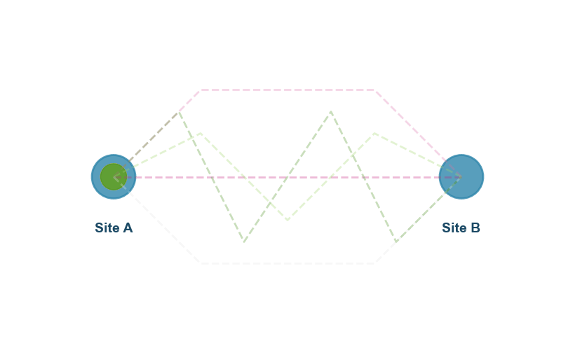

# <span style="color:#e67e22"><b>e</b></span>ntropy-driven <span style="color:#e67e22"><b>S</b></span>olid-<span style="color:#e67e22"><b>S</b></span>tate <span style="color:#e67e22"><b>E</b></span>lectrolyte <span style="color:#e67e22"><b>(eSSE)</b></span> [](https://www.gnu.org/licenses/gpl-3.0)

The `eSSE` repository provides a comprehensive implementation of path entropy analysis for solid-state electrolytes (SSEs), enabling quantitative assessment of ionic diffusion based on the diversity of migration pathways. Key functionalities include the analysis of lithium-ion diffusion kinetics and the calculation of path entropy.


<a name="cite"> </a>
## Related Work
If you find this repository useful in your research, please consider citing our [related work](https://arxiv.org/abs/2412.07115).
```
@misc{guan2024unlockingionmigrationsolidstate,
      title={Unlocking the Ion Migration in Solid-State Electrolytes via Path Entropy}, 
      author={Qiye Guan and Kaiyang Wang and Jingjie Yeo and Yongqing Cai},
      year={2024},
      eprint={2412.07115},
      archivePrefix={arXiv},
      primaryClass={cond-mat.mtrl-sci},
      url={https://arxiv.org/abs/2412.07115}, 
}
```
## Table of Contents
- [Prerequisties](#prer)
- [Data](#data)
- [Author](#auth)
- [Demo](#demo)


<a name="prer"> </a>
## Prerequisites

To run `eSSE`, you will need several Python packages listed in `env.yml`. The recommended installation method is via [conda](https://conda.io/docs/index.html).

After installing conda, create a new virtual environment and install the dependencies with:
```
conda env create -f env.yml
```
Then to use eSSE, simply activate the virtual env.:
```
conda activate eSSE
```


<a name="data"> </a>
## Data
The data necessary to reproduce the simulation results with `eSSE` paper will be released soon. All files required to run `demo.ipynb` are already included in the `data/` directory.

<a name="auth"></a>
## Author
This package was developed and is maintained by [Qiye Guan](https://dximing.github.io/).

<a name="demo"></a>
## Demo

To get started with eSSE, you can run the provided demo notebook `demo.ipynb` to see how the path entropy analysis works in practice.

### 1. Clone the Repository

Begin by cloning this repository to your local machine if you have not already done so.

### 2. Set Up the Virtual Python Environment

Please refer to the [Prerequisites](#prer) section above for detailed instructions on creating the recommended virtual environment. This environment is required to run the `eSSE` notebook and ensures all necessary dependencies are installed.

### 3. Run the Demo Notebook

Once your environment is set up, open and execute the `demo.ipynb` notebook to explore the path entropy analysis workflow provided by `eSSE`.
